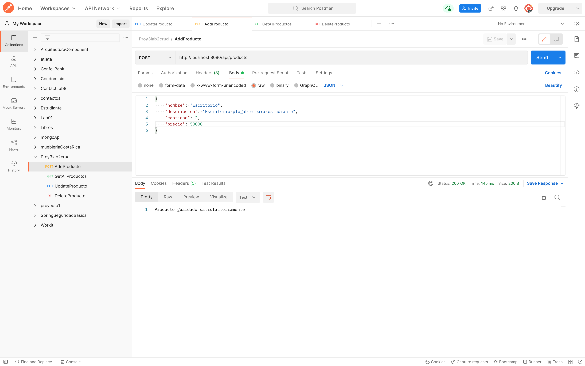
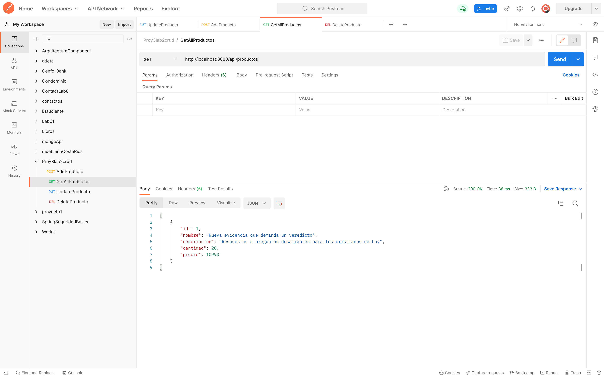
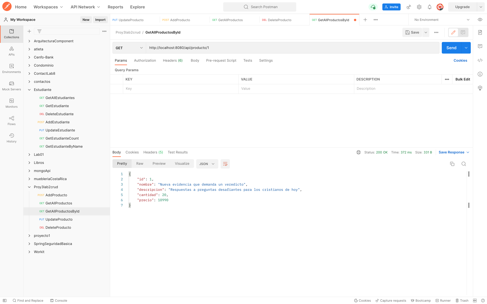
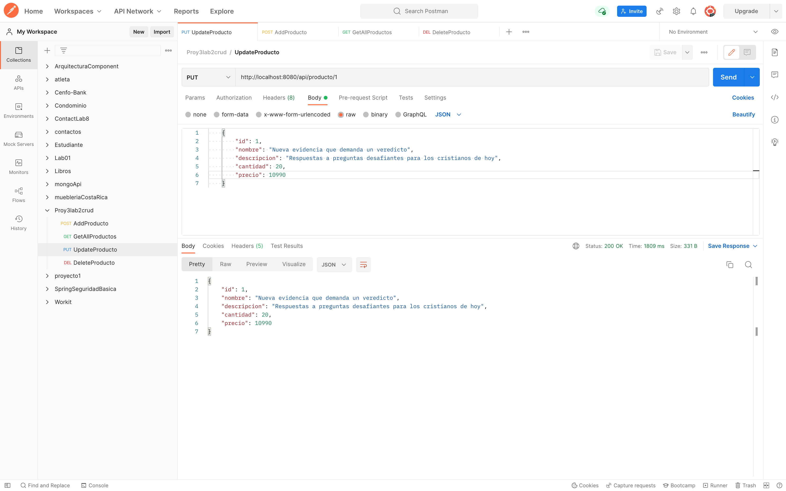
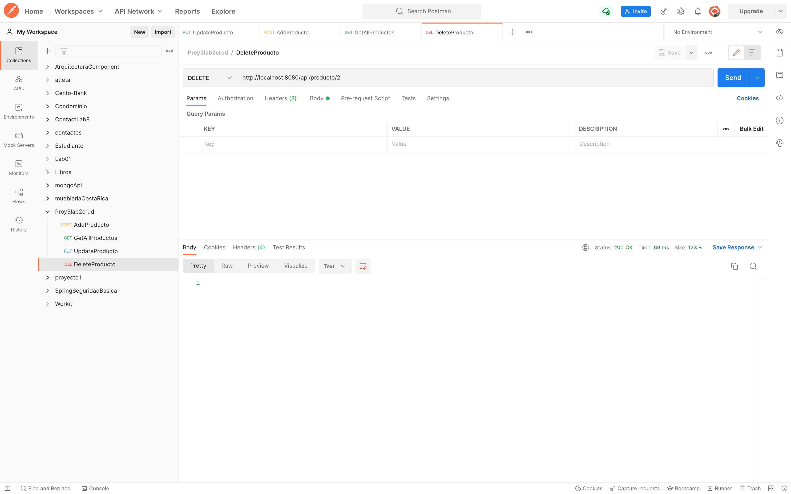
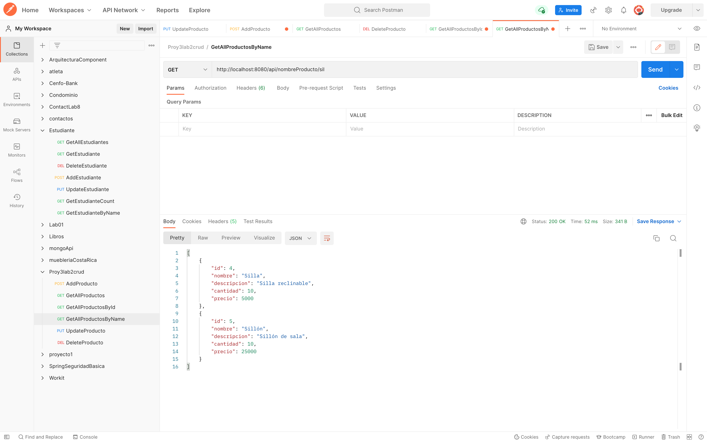

# Laboratorio 2, del curso de proyecto 3 UCenfotec

## Evidencia de PostMan

1. Crear Producto
   
    

3. Consultar todo los productos
   
    

5. Consultar producto por Id
   
    

7. Modificar un producto

    

8. Eliminar un producto

    

9. Busqueda de producto por nombre

    